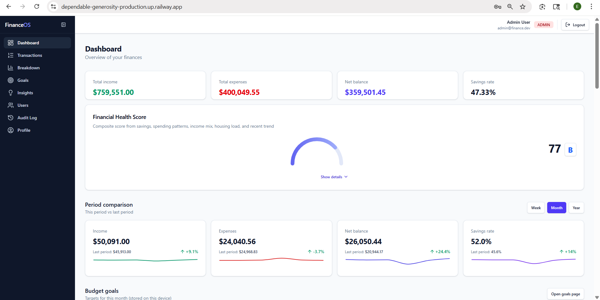
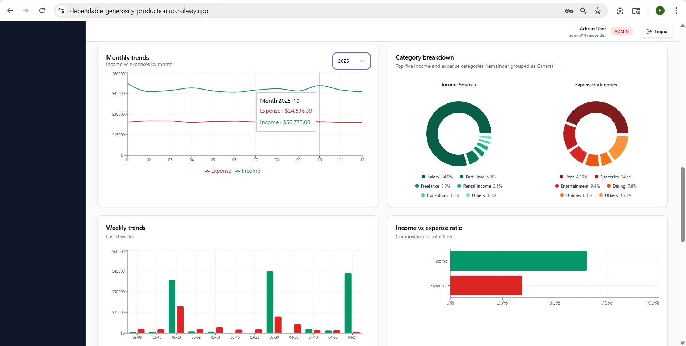
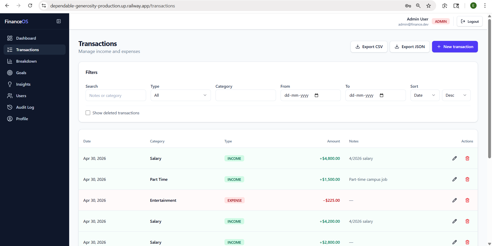
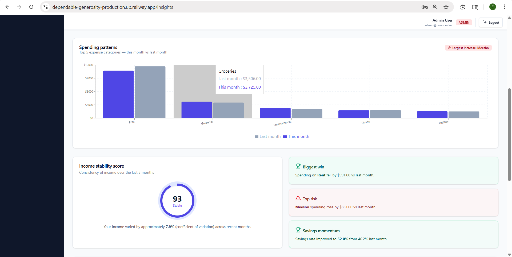

# FinanceOS — Finance Dashboard

A full-stack finance dashboard with role-based access control.

## Live Links

| | Link |
|---|---|
| **Live App** | [https://dependable-generosity-production.up.railway.app/login](https://dependable-generosity-production.up.railway.app/login) |
| **Swagger UI (API Docs)** | [https://financeos-dashboard-production.up.railway.app/api/docs](https://financeos-dashboard-production.up.railway.app/api/docs) |
| **Demo Video** | [https://drive.google.com/drive/folders/1SkTT3IK1L1LzPj4X5wwkKw8aMux9eIH3?usp=sharing](https://drive.google.com/drive/folders/1SkTT3IK1L1LzPj4X5wwkKw8aMux9eIH3?usp=sharing) |

## Screenshots

**Dashboard — Financial Health Score, Period Comparison, Budget Goals**


**Analytics — Monthly Trends, Category Breakdown, Weekly Trends, Ratio**


**Transactions — Export CSV/JSON, Filters, Soft Delete, Restore**


**Insights — Spending Patterns, Income Stability, Win/Risk Cards**


## Project Structure

| Path | Description |
|------|-------------|
| `backend/` | NestJS REST API, PostgreSQL, Prisma ORM |
| `frontend/` | React + Vite + Tailwind dashboard |

## Quick Start (Docker)
```bash
cd backend
docker compose up --build -d
cd ../frontend
npm install && npm run dev
```

Open [http://localhost:5173](http://localhost:5173)

## Test Accounts

All accounts use password **`password123`**

| Email | Role |
|-------|------|
| admin@finance.dev | ADMIN |
| analyst@finance.dev | ANALYST |
| viewer@finance.dev | VIEWER |
| sarah@finance.dev | ANALYST |
| mike@finance.dev | VIEWER |
| priya@finance.dev | ANALYST |

## Documentation

- **Live Swagger (interactive API):** [https://financeos-dashboard-production.up.railway.app/api/docs](https://financeos-dashboard-production.up.railway.app/api/docs)
- **Local Swagger:** [http://localhost:3000/api/docs](http://localhost:3000/api/docs)
- **Backend README:** [backend/README.md](backend/README.md)
- **Frontend README:** [frontend/README.md](frontend/README.md)

## License

Private / UNLICENSED